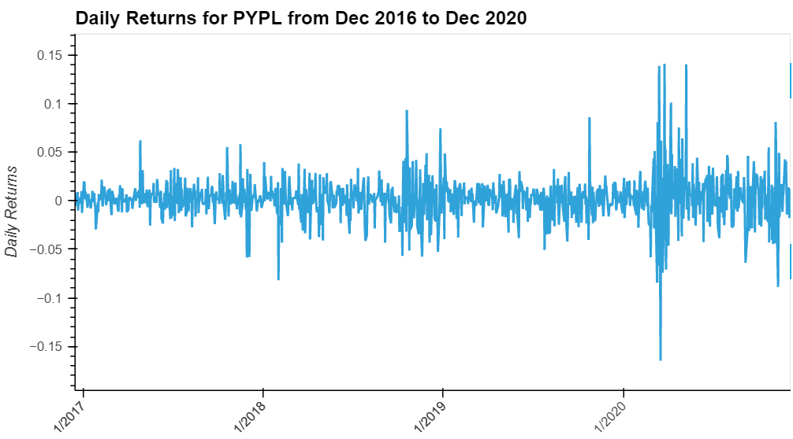
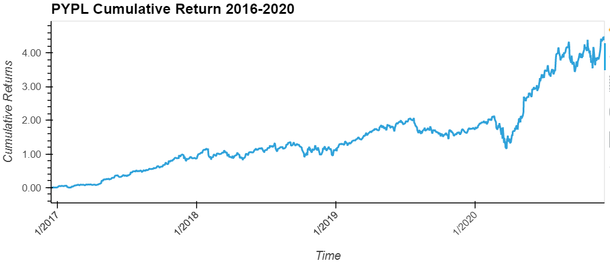
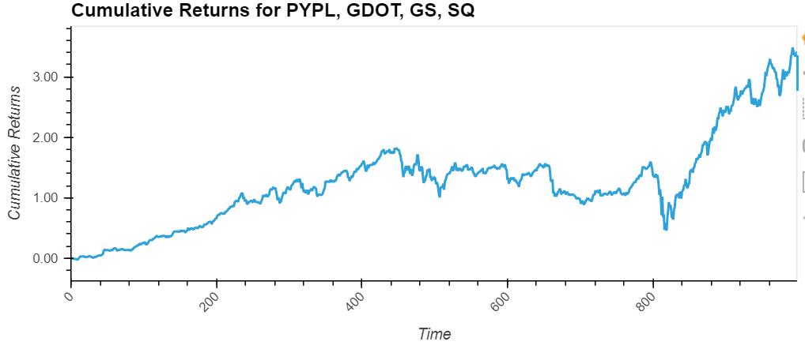
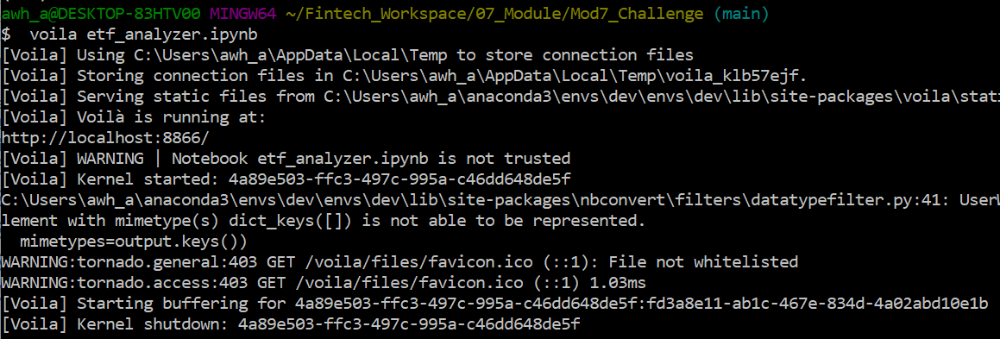
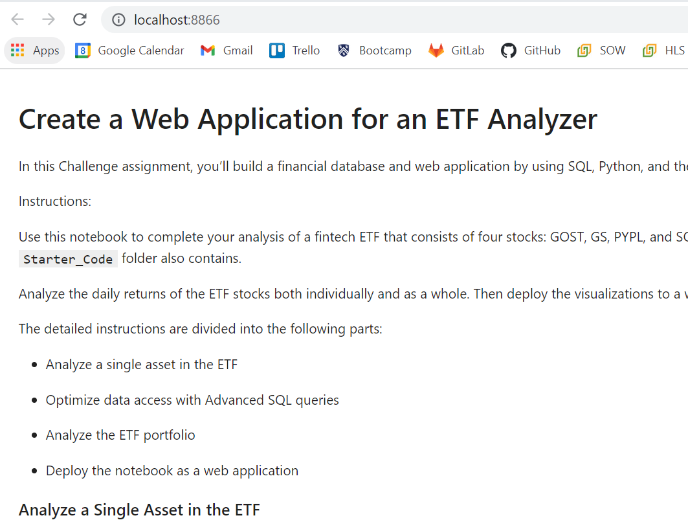

# Mod7_Challenge - Analyisis of an ETF and an ETF portfolio from SQL databae

This program pulls data from a SQL database to analyze results for an ETF called PYPL and plot daily returns
and cumulative returns. It also compares four ETFs (PYPL, GDOT, GS, SQ) in a portfolio and plots
daily returns and cumulative returns for the 4 ETFs. Finally, Voila was used to create a web page with results.

# Required programs and libraries

To install from terminal:
'''
conda install -c pyviz hvplot geoviews
'''

Libraries called in program:
'''
import numpy as np
import pandas as pd
import hvplot.pandas
import sqlalchemy
'''

# Data Sources
Data is pulled using sqlite from a SQL database provided in the Resources file

'''
database_connection_string = 'sqlite:///etf.db'

engine = sqlalchemy.create_engine(database_connection_string)
'''

# Sections

**Section 1:** Queries the database to pull and examine data for PYPL etf; creates an hvplot for daily returns

**Section 2:** For PYPL, calculates cumulative return and creates a plot
    
    

**Section 3:** Narrows data to meet specification such as when PYPL closing price is greater than 200
    
**Section 4:** Join data for four ETFs (PYPL, GDOT, GS, SQ) to compare daily and cumulative returns

**Additional Output** Webpage created by Voila from the Git Bash terminal

Commands to run voila and create a webpage of etf_analyzer.ipynb

Voila creates a webpage on the local host computer

    
# Creator
Program by Ann Howell with guidance from Rice FinTech Bootcamp

# License
MIT